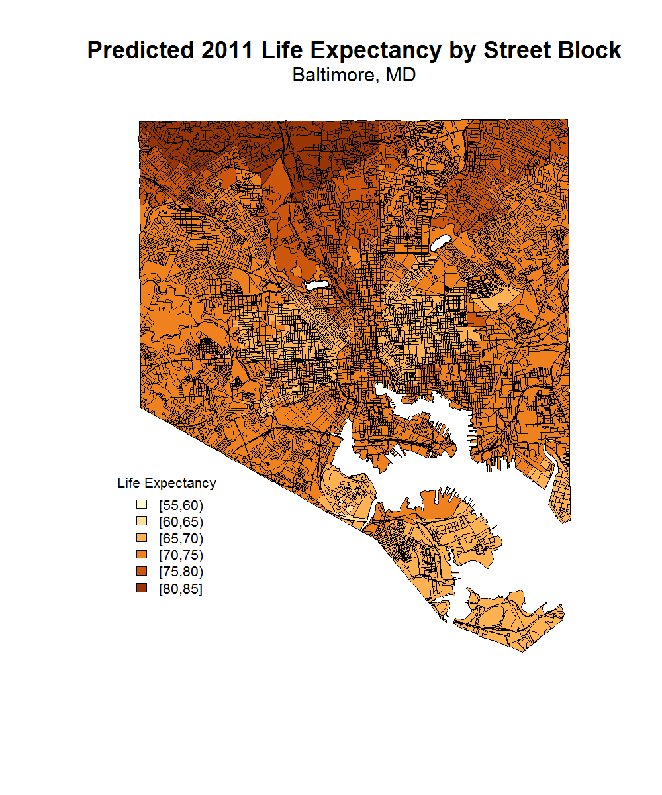

### Introduction:

Baltimore City, MD, is notorious for large discrepancies in the health of its population, which result in almost a 20 year life expectancy gap between neighborhoods only a few miles apart<sup>1</sup>. While there are many historical, economic, and social reasons that contribute to this phenomenon, perosnal income, as well as economic development of the surrounding area seem to play a major role<sup>2</sup>.  Furthermore, life expectancy was repeatedly found to be associated with race and educational attainment, <sup>3</sup>, as well as neighborhood crime levels<sup>4,5</sup> in previous studies.  

Most health-related data in Baltimore is collected on a neighborhood or Combined Statistical Area (CSA) level, however, due to the city's distinct economic and racial divisions, this might be too coarse of a tool to isolate areas where health interventions are needed the most. Thus we developed a model attempting to predict life expectancy on a street block level, using information from CSA's as well as point locations throughout the city. Exploratory analysis showed that life expectancy in Baltimore is spatially dependent, which has to be accounted for, and that crime, race, and economic factors were all associated with life expectancy. 


### Methods:

#### *Data Collection*

Data sources include: Baltimore Neighborhood Indicators Alliance<sup>6</sup>, the official website of Baltimore City<sup>7</sup>, and the Department of Planning of Maryland<sup>8</sup>. CSA-level data includes information on race, age, gender distributions, household income, households in poverty, birthweight, elevated blood lead levels in children, life expectancy, mortality by age, liquor store density, and fast food density, among other variables. Figure 1 contains Baltimore life expectancy values for 2011, and is representative of the format in which all the CSA data was obtained. In order to downscale from CSA to street block level, crime and vacant building coordinates from 2012, as well as household state and city taxes from the same year were obtained from the Baltimore City website. A shapefile of blocks in Maryland was obtained from the Department of Planning. Crime and vacant building counts, as well as the tax averages were obtained for each block and each CSA by spatially merging block and CSA shapefiles with the point-level crime, vacant building, and tax shapefiles using ArcGIS 10.4.1. The results included one shapefile with block-level data, and one shape file with CSA level data. The specific steps taken in order to create the shapefiles used for the prediction model are outlined in the Appendix. 

```{r echo=FALSE, include=FALSE, eval=TRUE}
# code that creates all the directories
if (!require("knitr")) install.packages("knitr")
library(knitr)
source('create_directories.R')

```

```{r echo=FALSE, include=FALSE, eval=TRUE}
# code that downloads the necessary data
source(file.path('R_code', 'Get_raw_data.R'))
```

```{r echo=FALSE, include=FALSE, eval=TRUE}
# code that cleans the point level data before it is merged
# in ArcGIS
source(file.path('R_code', 'Clean_Point_Data.R'))
```


#### *Exploratory Analysis*

Exploratory analysis was conducted to check the completeness of the data, to determine which variables are related to life expectancy, and to check for spatial autocorrelation. 2011 life expectancy was determine best fit to build the model, since most of the avaliable variables were closest to that year. Nine blocks located in the Oldtown/Middle East area were found to contain no information from CSA's, due to a hole in the CSA shapefile. The missing values were assumed to be the same as the ones in the Oldtown/Middle East CSA. Otherwise, the data was found to be complete. 

A major assumption of this model is that variables that predict life expectancy on a CSA level behave in a similar way at the block level, thus, several steps were taken to make variables in the CSA's and blocks more comparable. Crime and vacant building counts were divided by tract and block areas in their respective shapefiles, to create crime and vacant building densities, which showed more similar distributions between block and CSA levels than counts did. Furthermore, to make variables even more comparable between CSA's and city blocks, each one was represented as a deviation from its mean, divided by its variance. Variables were tested for multicollinearity, and several generalized linear models were compared using Spearman's correlation and RMSE. Finally, using Moran's I correlograms, it was determined that life expectancy in Baltimore is spatially autocorrelated, which was partially accounted for by including the CSA and block centroid coordinates as model variables. 

```{r echo=FALSE, include=FALSE, eval=TRUE}
# code for the Exploratory analysis, including spatial
# autocorrelation
source(file.path('R_code', 'Exploratory_1.R'))
```

#### *Statistical Modeling*

A generalized linear model was used to predict life expetancy at a street block level, and is represnted below: 

*LE= B~0~ + B~1~femhhs10 + B~2~crime_den + B~3~vacancy_den + B~4~racdiv10 +  B~5~X + B~6~Y + e*

Where *LE* is life expectancy in 2011, *femhhs10* is percent of households headed by women in 2010, *crime_den* is crime density, *vacancy_den* is vacant house density, *racdiv10* is racidal diversity, defined as the percent chance that two people picked at random in the area will be of different race, *X* and *Y* are the longitude and latitude of the block centroids, respectively, and *e* is error. All of these variables were standardized as deviation from their means divided by their variance, as described above. Vacant house density was chosen as a surrogate measurment for a neighborhood development index, while proportion of female-headed households was considered as a surrogate for household income<sup>9</sup>. The model was built using the CSA shapefile, where 30 CSA's were randomly chosen as a training set, and 25 as a test set. It was then applied to the street block shapefile.  


#### *Reproducibility*
An R markdown document provides the code to obtain and clean all the data, and conduct all the statistical analysis presented here. Additionally, the appendix provides all the steps taken in ArcGIS to spatially join necessary files in order to produce the final shapefiles used in analysis. 

###Results

The predicted life expctancy by block ranged from approximately 59 years to 82 years, with a confidence interval spanning 11.15 years at the narrowest point and 30.67 at the widest. 
Figure 2 displays the predicted life expectancy by street block, and Figure 3 displays the lower and upper bounds of the 95% confidence intervals.  

```{r echo=FALSE, include=FALSE, eval=TRUE}
# Code to produce the final figures
source(file.path('R_code', 'Final_Analysis.R'))
```

###Discussion

There are several important limitations to the prediction model described above. Most importantly, downsampling from CSA's to street blocks was accomplished by calculating the crime and vacant house densities within each block and within each CSA, and using these variables at both block and CSA levels. In order for this to work, we have to assume that the associations between these variables and life expetancy on a CSA level follows the same pattern as they do on a block level. In order to test this idea, one could "scale up" and compare CSA data with the same data within all counties of the state. Once the relationship between county and CSA has been established, one could extraploate this relationship down to the block level. Furthermore, important factors such as personal income, neighborhood development index, and access to healthcare were not directly included in this analysis. Instead, tax information, percent of households headed by women, and vacan building density were analyzed, since it was assumed that these variables are highly related to income and neighborhood development, and thus can be used as surrogates.

As we demonstrated above, while most data related to life expectancy is avaliable either on a CSA scale or on a point level scale, one could combine these two sources of data in order to predict life expetancy on a street block scale. Such an improvement in spatial resolution could help public health officials and policy makers target areas that need help the most, with higher precision. 

### Acknowledgements

I greatly appreciate the advice of Kayode Sosina and Yifan Zhou regarding obtaining data and choosing the proper staistical analyses for this project.

### Figures


Figure 1: Baltimore, MD life expectancy by CSA in 2011. 
 

Figure 2: The predicted life expetancy by street block in Baltimore, MD. 


Figure 3: Lower and upper bounds of the 95% confidence interval for the prediction of life expectancy by street block. 

  
\newpage

### References

1. Ames et al., Baltimore City 2011 Neighborhood Health Profile, 2011. 
2. Chetty R, Stepner M, Abraham S, et al. The Association Between Income and Life Expectancy in the United States, 2001-2014. JAMA. 2016;315(16):1750-66.
3. Olshansky SJ, Antonucci T, Berkman L, et al. Differences in life expectancy due to race and educational differences are widening, and many may not catch up. Health Aff (Millwood). 2012;31(8):1803-13.
4. Redelings M, Lieb L, Sorvillo F. Years off your life? The effects of homicide on life expectancy by neighborhood and race/ethnicity in Los Angeles county. J Urban Health. 2010;87(4):670-6.
5. Neighborhood-Level Determinants of Life Expectancy in Oakland, CA., 2012, Virginia Commonwealth University, Richmond Vrigina. 
6. Baltimore Neighborhood Indicators Alliance, University of Baltimore, http://bniajfi.org/
7. City of Baltimore official website, http://www.baltimorecity.gov/
8. Maryland Depratment of Planning, http://www.mdp.state.md.us/
9. Elise Gould, "Two in five female-headed families with children live in poverty", Economic Policy Institute, 2010 


### Appendix 


#### *Merging Shapefiles in ArcGIS*

ArcGIS 10.4.1 for Desktop was used to merge shapefiles in order to obtain
one shapefile with block-level data, and one shape file with CSA level data.

The following steps were taken:

1. Shapefiles Real_Property.shp, blk2010.shp, VS14_Health.shp, VS14_Census.shp, crime_.csv, estate_.csv, and vacant_.csv were uploaded into ArcMap. The projection for all the shapefiles was set to 
NAD 1983 Maryland State Plane (feet)

2. County 24510 (Baltimore County) was selected from the blk210 shapefile and saved as a separate shapefile (balt.shp)

3. Using the Spatial Join tool, crime point data (crime_.csv), estate tax point data (estate_.csv), and vacant building point data (vacant_.csv) was joined (many to one) to the street block shapefile (balt.shp), resulting in the shapefile balt_vac_crime_estate.shp

3. The Spatial Join tool was used to join (one to one) the CSA shapefile (VS14_Census.shp), and the Health shapefile (VS14_Health.shp) to the Blatimore blocks shapefile created in the previous step (balt_vac_crime_estate.shp)

4. The resulting shapefile was named balt_vac_crime_estate_cen_health_feet.shp, and saved in "Analyzed_Data/ArcGIS". It contained all the necessary data on the street block scale. 

6. In order to get all the data on CSA level, the exact same steps were repeated, but without using the block-level shapefile. Thus, the CSA shapefile (VS14_Census.shp) was joined to the Health shapefile (VS14_Health.shp) and then joined to the the crime point data (crime_.csv), estate tax point data (estate_.csv), and vacant building point data (vacant_.csv). The resulting shapefile was named track_health_cens_crim_est_vac.shp and also saved in "Analyzed_Data/ArcGIS". 

7. All the subsequent data cleaning and analysis was conducted using R 3.3.1


