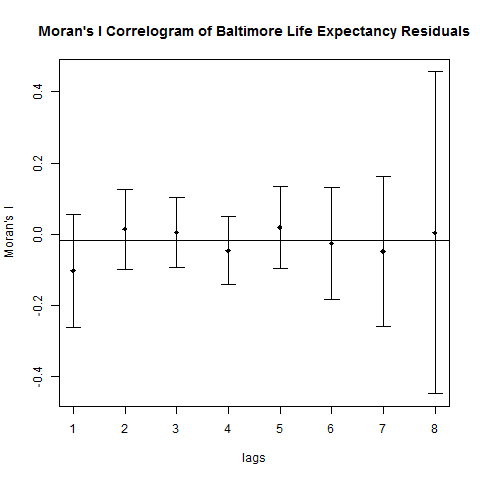

#### *Data Collection*

Data sources include: Baltimore Neighborhood Indicators Alliance, the official website of Baltimore City, and the Department of Planning of Maryland. Data includes information on CSA-level race, age, gender distributions, household income, households in poverty, Birthweight, elevated blood lead levels in children, life expectancy, mortality by age, liquor store density, fast food density, crime rates, and property values, among other variables. A shapefile of blocks in Maryland was obtained from the Department of Planning. The datasets and shapefiles were merged and cleaned using both R and ArcGIS 10.4.1, resulting in one shapefile with block-level data, and one shape file with CSA level data. Figure 1 contains Baltimore life expectancy values for 2011, and is representative of the format in which all the CSA data was obtained. 

```{r echo=FALSE, include=FALSE, eval=FALSE}
# code that creates all the directories
if (!require("knitr")) install.packages("knitr")
library(knitr)
source('create_directories.R')

```

```{r echo=FALSE, include=FALSE, eval=FALSE}
# code that downloads the necessary data
source(file.path('R_code', 'Get_raw_data.R'))
```

```{r echo=FALSE, include=FALSE, eval=FALSE}
# code that cleans the point level data before it is merged
# in ArcGIS
source(file.path('R_code', 'Clean_Point_Data.R'))
```

```{r echo=FALSE, include=FALSE, eval=FALSE}
# code for the Exploratory analysis, including spatial
# autocorrelation
source(file.path('R_code', 'Exploratory_1.R'))
```


#### *Exploratory Analysis*

Exploratory analysis was conducted to check the completeness of the data, to determine which variables are related to life expectancy, and to check for spatial autocorrelation. 2011 life expectancy was determine best fit to build the model, since most of the avaliable variables were closest to that year. 

Nine blocks located in the Oldtown/Middle East area were found to contain no information from CSA's, due to a hole in the CSA shapefile. 


Figure 1: Life expectancy in Baltimore by block and by CSA. The "hole" in the CSA shapefile
is visible in the downtown area, which translated to a missing values for 9 blocks. The missing values were assumed to be the same as the ones in the Oldtown/Middle East CSA. Otherwise, the data was found to be complete. 

A major assumption of this model is that variables that predict life expectancy on a CSA level behave in a similar way at the block level. This is more true for values that were derived from CSA's, such as Life Expectancy or Meah Household Income:


Figure 2: Life Expectancy and Mean Household Income histograms by block and by tract. The distributions seem similar, which makes sense, since block level data is derived from CSA level data.


Figure 3: Crime and Building Vacancy histograms for blocks and CSA's. It looks like the distributions are not that similar between CSA's and blocks once we use point-level data.

The major difference between blocks and CSA's is that CSA's cover a larger area. Thus, if we can assume that there is a distinct association between area and crime or building vacancy, and that this association is the same in blocks and CSA's of different areas, we have more evidence to show that these two levels are comparable.


Figure 4: Shows such an association, plotting crime and building vacancy against CSA area and block area. It looks like the patterns are somewhat similar between blocks and CSA's.


Crime and vacant building counts were divided by tract and block areas in their respective shapefiles, to create crime and vacant building densities, which showed more similar distributions between block and CSA levels than counts did. Furthermore, to make variables even more comparable between CSA's and city blocks, each one was represented as a deviation from its mean, divided by its variance.


Variables were tested for multicollinearity,


and several generalized linear models were compared using Spearman's correlation and RMSE. 


Finally, using Moran's I correlograms, it was determined that life expectancy in Baltimore is in spatially autocorrelated, which was partially accounted for by including the CSA and block centroid coordinates as model variables. 


Figure 5 is a Moran's I correlogram, showing that tracts that are closer to each other are more strongly correlated. As you move away, there is less and less correlation between tracts. 



Figure 6: When we account for spatial autocorrelation using a spatial simultaneous autoregressive lag model (lagsarlm package), this autocorrelation is taken care of. This machine could not build a lagsarlm model on the block shapefile, since there were too many variables, and it ran out of RAM. 


Figure 7: However, we can partially account for spatial autocorrelation even when using a linear model by including the X and Y coordinates as our variables.

To look at all the output produced during the exploratory analysis, please run Exploratory_1.R


```{r echo=FALSE, include=FALSE, eval=FALSE}
# code for the Exploratory analysis, including spatial
# autocorrelation
source(file.path('R_code', 'Exploratory_1.R'))
```


  